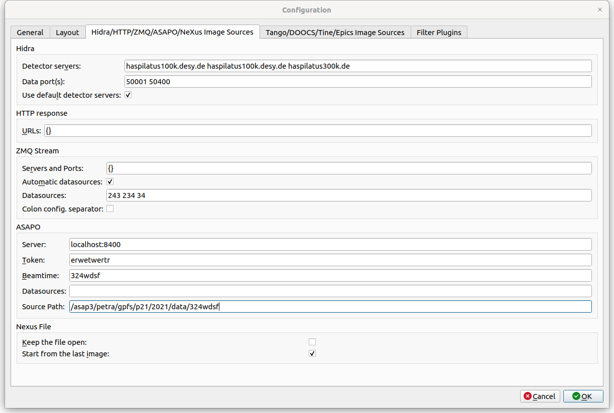

Hidra/HTTP/ZMQ/ASAPO/NeXus Image Source Settings
================================================

The third tab of the configuration dialog contains **Image Sources** configuration.
It allows for the user to adjust image sources and their dialogs.

**Hidra**

*    **Detector servers:**  possible hidra detector hosts separated by spaces
*    **Data port:** hidra data port or ports separated by spaces (for the multi image source mode). The default port gap in the multi image source mode is 200. Each instance of lavue on the same host should use a different data port.
*    **Use default detector servers:** add default detector server names from the DESY pool

**HTTP response**

*    **URLs:** `JSON <https://www.json.org/json-en.html>`_ dictionary assigning labels to HTTP urls

**ZMQ Stream**

*    **Servers and Ports:** `JSON <https://www.json.org/json-en.html>`_ dictionary assigning labels to server and port of ZMQ stream
*    **Automatic datasources:** selects possible datasources from ZMQ stream metadata
*    **Datasources:** defines possible datasources, i.e. ZMQ topics, separated by spaces

**ASAPO**

*    **Server:** ASAPO servers, i.e. host:port
*    **Token:** token to asapo servers
*    **Beamtime:** a name of beamtime used by asapo
*    **Datasources:** defines possible datasource names which are separated by spaces
*    **Source Path:** a path to ASAPO files, e.g. /asap3/petra.gpfs/{beamline}/{year}/data/{beamtime_id}

**Nexus File**

*    **Keep the file open:** does not close the nexus file after reading the field frame
*    **Start from the last image:** displays only the last image frame

.. |br| raw:: html

      
