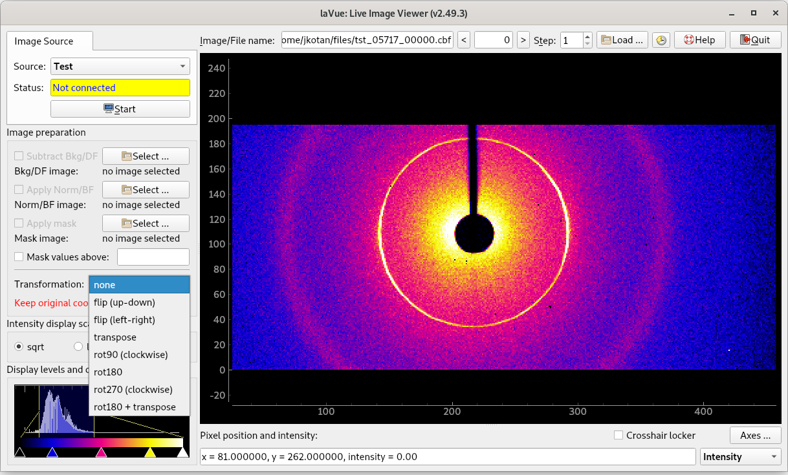

.. _image-preparation:

Image Preparation
=================

*    **Background/DarkField image:** subtract background or dark field image from a file or from an image source
*    **Normalization/BrightField image:** apply normalization or bright field image correction from a file or from an image source, i.e. `(image - DF) / (BF - DF)`
*    **DF scaling factor:** multiplicative correction to the background or dark field image
*    **BF scaling factor:** multiplicative correction to the brightfield  image
*    **Mask image:** mask plotted image with respect to a file.
     Convention of zero mask pixels can be set in the configuration,  by default none-zero masks pixel to zero.
*    **Mask values above:** mask image pixels which have intensity above the given value
*    **Transformation:** all 8 possible. Whether axes are changing with transformations or not can be set in the configuration.

Background image and mask image can be loaded from the file formats supported by `fabio <https://pypi.org/project/fabio/>`_ or a `NeXus file <https://www.nexusformat.org/>`_.
