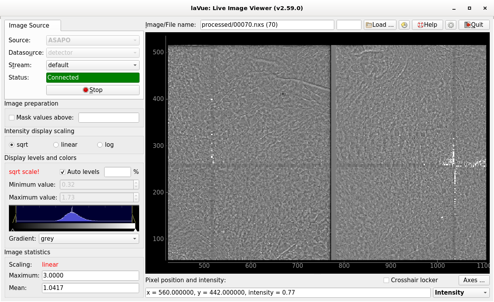

.. _asapo:

ASAPO
=====

Images from a  `ASAP::O <https://confluence.desy.de/display/ASAPO/ASAP%3A%3AO>`_ server, e.g. detector servers. It is used to *send post-processed images*

The **ASAPO** image source frame contains the following fields:

*    **Datasource:** name of asapo datasource. Possible datasources can be predefined in the configuration. The default one is `detector`
*    **Stream:** name of asapo stream. List of streams  is fetched from the ASAPO server. The default one in default while `**ALL**` corresponds to the last one image from all datasources.
*    **Status:** shows the connection status. It also displays a port of ZMQ security stream if it is enabled.
*    **Start/Stop** button to launch or interrupt image querying

In order to use **ASAPO** image source user has to set an asapo `server`, an asapo `token` and an asapo `beamtime` in the lavue Configuration.

.. |br| raw:: html

      
