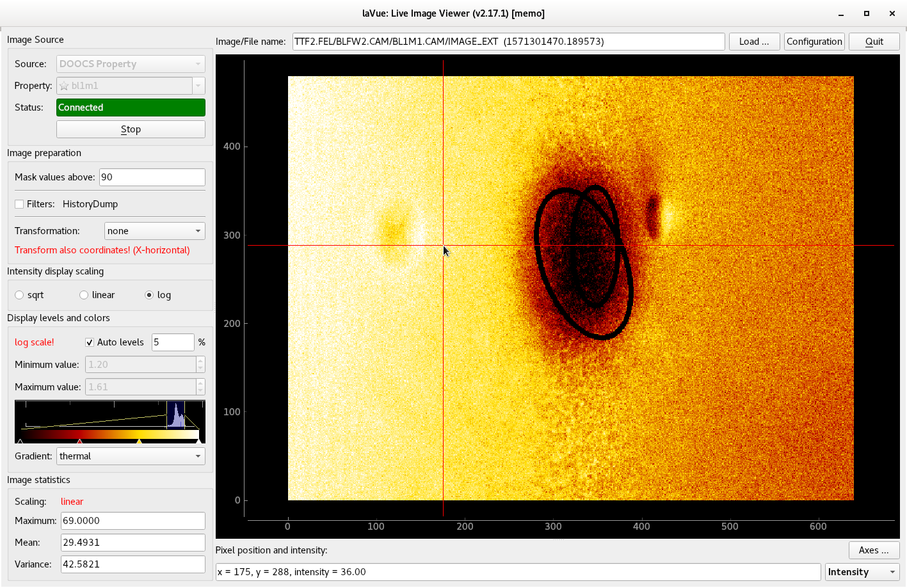

.. _doocs-prop:

DOOCS property
==============

Images from a tango attribute, e.g. `FLASH` detectors

The **DOOCS Property** image source frame contains the following fields:

*    **Property:** selects the doocs property,
     |br| e.g. `TTF2.FEL/BLFW2.CAM/BL0M0.CAM/IMAGE_EXT`.
     |br| The possible properties can be preselected in the configuration dialog.
*    **Status:** shows the connection status. It also displays a port of ZMQ security stream if it is enabled.
*    **Start/Stop** button to launch or interrupt image querying

By clicking on an **empty start** in the Property combobox you can add a label to the current  item (only in the expert mode).

By clicking on an **full start** in the Property combobox you can remove the label of the current  item (only in the expert mode).

.. |br| raw:: html

      
