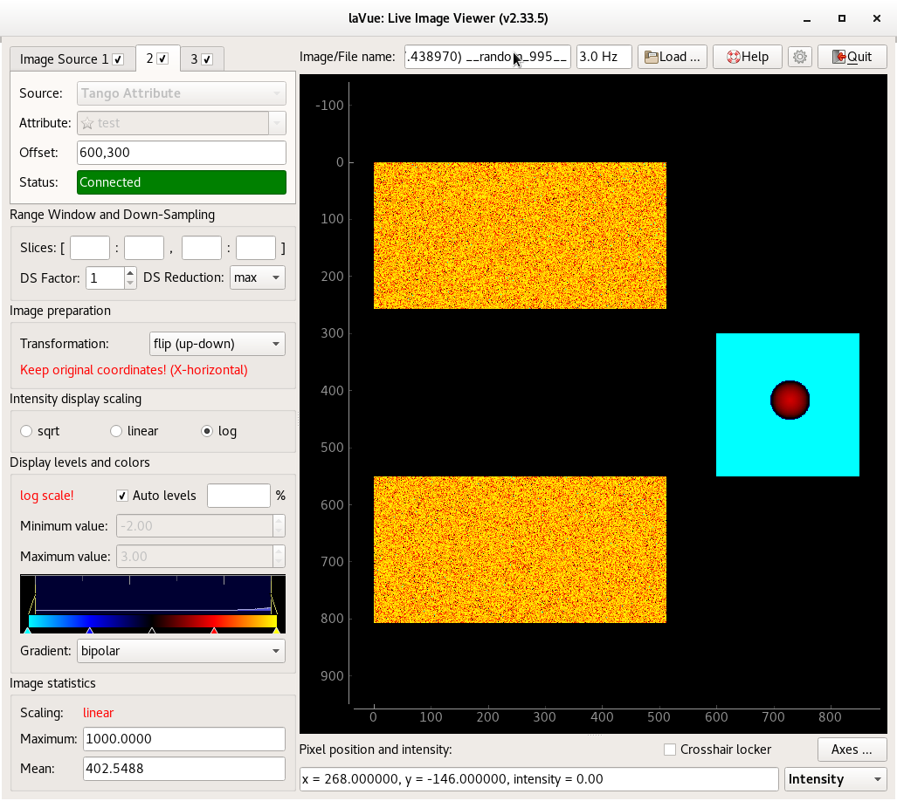

.. _image-sources:

Image Sources and stitching images
==================================

The user can select in the **IMAGE SOURCES** combo-box  the following source types:

*    :ref:`Hidra <hidra>` - image from a Hidra server, e.g. Pilatus, Perkin Elmer
*    :ref:`HTTP response <http>` - image from an http response, e.g. Eiger
*    :ref:`Tango Attribute <tango-attr>` - image from a tango attribute, e.g. Lambda, PCO, AGIPD, Jungfrau or LimaCCDs detectors
*    :ref:`Tango Events <tango-events>` - image from a tango attribute passed via tango events, e.g. LimaCCDs detectors
*    :ref:`Tango File <tango-file>` - image defined by file and directory tango attributes, e.g. Pilatus w/o Hidra
*    :ref:`DOOCS Property <doocs-prop>` - image from a doocs property, e.g.  FLASH detectors
*    :ref:`ZMQ Stream <zmq-stream>` - image from a simple ZMQ server, e.g. lavuezmqstreamfromtango SERVER
*    :ref:`Nexus File <nexus-file>` - image from a Nexus/Hdf5 file, e.g. written with SWMR
*    :ref:`Tine Property <tine-prop>` - image from a tine property, e.g. bpm camera
*    :ref:`Epics PV <epics-pv>` - image from a Epics Process Variables
*    :ref:`ASAPO <asapo>` - images from a ASAPO server, e.g. data from detectors or postprocessed data
*    :ref:`Test <test>` - random test image

By enlarging a number of image sources in  the *expert* mode:

.. code-block:: console

        Configuration -> General -> Number of image sources

the user  can **combine images** from different sources, i.e. different detectors or detector modules.

*    **Offset**: ``x,y[,TRANSFORMATION]``  where ``x``, ``y`` are position of the first pixel for a particular image source while optional ``TRANSFORMATION`` can be  ``flip-up-down``, ``flipud``, ``fud``, ``flip-left-right``, ``fliplr``, ``flr``, ``transpose``, ``t``, ``rot90``, ``r90``, ``rot180``, ``r180``, ``r270``, ``rot270``, ``rot180+transpose``, ``rot180t`` or ``r180t``
*    **Checkbox** in the tag widget allows for switch on/off the corresponding image source

**Start**/ **Stop** button is only at the first source but it applies to all image sources.

.. toctree::
   :caption: Table of Contents
   :maxdepth: 2

   hidra
   http
   tangoattr
   tangoevents
   tangofile
   doocsprop
   zmqstream
   nexusfile
   tineprop
   epicspv
   asapo
   test
