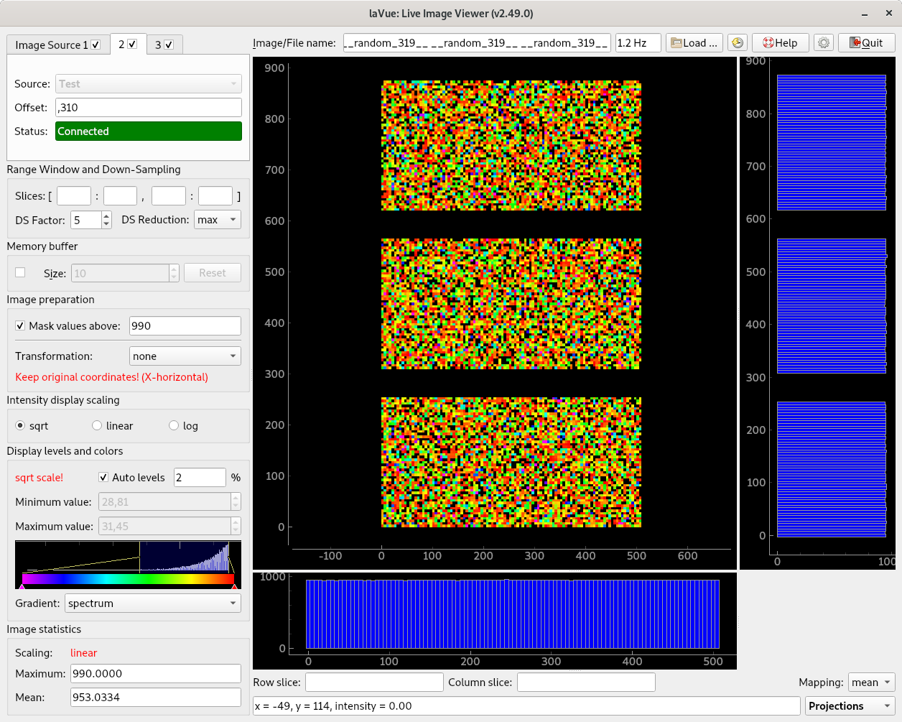

  .. default-domain:: py

GUI User Guide
==============

*    A widget with :ref:`Image Source(s) <image-sources>`  is in the corner of the main window top left side where a lavue user chooses  a detector image source.

..

*    Below it  the :ref:`Range Window and Down-Sampling <range-window>` group allows for selecting a displayed image part and down-sampling it  with a given reduction function
*    In the :ref:`Filters <lavue-filters>` group users adds his/her plugins for evaluating images
*    the :ref:`Memory buffer <memory-buffer>` group allows to access previously displayed images
*    In the :ref:`Image preparation <image-preparation>` group a background and mask image can be selected as well simple image transformation, i.e. flip, transpose.
*    In the :ref:`Intensity display scaling <scaling>` frame the user selects what intensity scaling should be selected to fit the proper colors on the 2D-image display.
*    The :ref:`Display levels and colors <scaling>` widget is used so set minimum and maximum displayed intensity and choose the display color gradient.
*    The :ref:`Image statistics <statistics>` part shows the basic statistic information about the 2D-image.

..

*    On the top right side of the main window the user finds an **Image/File name** label as well as a button for :ref:`Load <images>` images from a file-system, **Reload** images from a file -system, this Help, the :ref:`Configuration <configuration>` and Quit buttons.
*    Below them the detector :ref:`2D image <2d-plot>` is displayed with associated **1D-plots**.

..

*    At the bottom of the right side the user selects :ref:`Specialized Image Tools <special-tools>` which provide a simple analysis of the detector image.

.. toctree::
   :caption: Table of Contents
   :maxdepth: 2

   imagesources/index
   rangewindow
   filters
   memorybuffer
   imagepreparation
   scaling
   statistics
   plot
   tools/index
   images
   configuration/index
